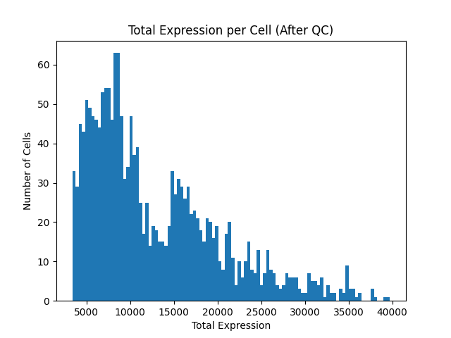
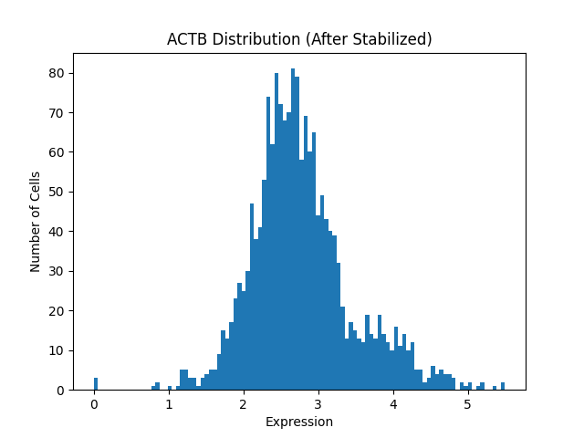

# scRNA Expression Analysis Pipeline

# Overview

본 프로젝트는 raw scRNA-seq data를
 **분석 가능한 상태로 만들기 위한 전처리 및 검증 파이프라인**입니다.

단일 세포 RNA 발현량 분석 과정에서

- 왜 raw data만으로 분석을 시작할 수 없는지,
- 그리고 분석 가능한 데이터로 가공하기 위해 어떤 판단을 거쳐하는지를

학습하기 위해 프로젝트를 진행하였습니다.

[single-cell-pipeline](https://github.com/jyjunPepe012233/single-cell-pipeline) 레포지토리에서 학습한 **4단계 데이터 처리 파이프라인과 사고 구조**를 바탕으로,
  **raw scRNA-seq data(.mtx, .tsv)를 입력으로 다룰 수 있도록 확장**한 프로젝트입니다.

# Learning Motivation

이 프로그램의 파이프라인을 개발하기 위해, 저는 다음과 같이 질문했습니다.

- **raw scRNA-seq data를 바로 분석할 수 없는 이유는 무엇인가?**
- 세포의 품질이란 무엇이며, **저품질 세포를 제거하면 데이터에 어떤 변화가 생기는가?**
- 세포별 유전자 발현량 측정 시, **해당 값을 정규화하는 것은 무엇을 위한 과정인가?**
- 유전자별 발현량 분포 측정 시, log를 통해 **분포를 안정화(stabilization)하는 것은 무엇을 위한 과정인가?**

이러한 질문들을 통해 단일 세포 분석에 대한 지식을 쌓았으며,
  데이터 처리 및 분석 과정에서 겪는 고민을 직접 경험할 수 있었습니다.

# What This Pipeline Does

- raw scRNA-seq data (.mtx, .tsv) 로드 (`/src/data_io.py`)
- 세포 단위 품질 관리 (`/src/schema.py`)
- library-size 정규화 및 log 안정화 (`/src/normalization.py`)
- 전처리 전·후 분포 비교를 통한 검증 (`/src/visualization.py`)

실제 연구 현장의 세세한 요구 사항에 따라 개발하기 보다 **연구 과정에서 겪을 수 있는 핵심 문제들을 직접 경험**하고,
  이에 대한 스스로의 해결 방법과 그 근거를 남기며 생물정보학과 가까워지는 것을 목표로 임했습니다.

# Analysis Pipeline

## Step 1. Data Loading & Structural Validation

인터넷에서 제공받은 실제 scRNA-seq data를 사용했습니다.

.mtx 형식의 데이터를 DataFrame으로 변환하는 모듈을 개발하였습니다.

## Step 2. Quality Control (QC)

`describe()`를 통해 총 RNA 발현량이 0인 세포가 다수 존재함을 확인했습니다.

캡쳐 또는 시퀀싱 과정에서 원활히 측정되지 않았거나 죽은 세포로 판단하였고, RNA 발현량이 특정 수치 미만인 세포들을 분석 대상에서 제외하였습니다.

또한, 데이터세트마다 값의 범위 또는 데이터의 특징이 다르다는 점을 파악하여
  프로그램의 엔트리 포인트에서 품질 최소 기준(`quality_min_threshold`) 또는 이상치 기준(`max_value_limit`) 등의 수치들을 설정할 수 있게 하였습니다.

### Raw Data vs After QC (Total Expression per Cell)

  
  

## Step 3. Normalization & Stabilization

raw scRNa-seq data는 시퀀싱 깊이 등으로 인해 세포마다 총 발현량의 규모가 다릅니다.

이는 정규화하지 않은 상태에서 RNA 발현량을 비교하는 것이 의미가 없음을 뜻하므로,
  비교 전에, 각 세포의 총 발현량을 동일한 규모(기본 10,000, 설정 가능)로 정규화하였습니다.

또한, 분포한 데이터의 상대적 차이가 비교 가능한 규모로 표현될 수 있도록
  numpy의 `log1p`를 통해 분포를 안정화(stabilization)하였습니다.

### Raw Data vs After Processing (Expression Distribution of Specific RNA)

  
  

## Step 4. Visualization

QC 및 정규화 과정의 효과를 검증하기 위해 처리 과정 전, 후를 시각화하여 비교하였습니다.

처리가 끝난 데이터를 다음과 같이 시각화하였으며, 결과는 `/images/` 폴더에 저장되어 있습니다.

- 세포별 총 발현량 분포 (QC 전 / 후)
- 특정 유전자의 발현 분포 (전체 처리 전/ 후)

# What I Learned

이 프로젝트를 통해 다음 질문에 답할 수 있게 되었습니다.

- **raw scRNA-seq data를 바로 분석할 수 없는 이유는 무엇인가?**
    - 실제 측정 데이터는 예상과 다른 형식을 가질 수 있으며, 결측치, 이상치 등의 값이 존재하므로
    데이터의 정확성과 일관성을 높이기 위해서는 반드시 데이터를 전처리하는 과정이 필요하다.

- 세포의 품질이란 무엇이며, **저품질 세포를 제거하면 데이터에 어떤 변화가 생기는가?**
    - 캡쳐 또는 시퀀싱 과정에서 문제가 생겼거나 이미 죽어 RNA 발현량이 0으로 측정된 세포를 분석하는 것은 의미가 없으므로,
    이 세포는 저품질 데이터로 간주하고 데이터세트에서 제거한다
    - 이를 통해 의미 있는 데이터만을 비교할 수 있게 된다.
 
- 세포별 유전자 발현량 측정 시, **해당 값을 정규화하는 것은 무엇을 위한 과정인가?**
    - 시퀀싱을 통해 세포의 RNA 발현량을 측정하면 시퀀싱 깊이 차이로 인해 다른 세포와 발현량의 규모가 다를 수 있다.
    - 전체 RNA 발현량(발현량 규모)이 다르면 특정 RNA 발현량의 상대적 차이를 비교할 수 없으므로, 일정한 수준으로 발현량을 정규화시킬 필요가 있다.

- 유전자별 발현량 분포 측정 시, log를 통해 **분포를 안정화(stabilization)하는 것은 무엇을 위한 과정인가?**
    - 전체 세포에 대한 특정 RNA 발현량을 나타내었을 때, 몇 극단값이 전체 분포에 영향을 끼치므로 log를 사용하여 분포를 안정화시킬 필요가 있다.
    - 안정화 시 각 세포에 대한 특정 RNA 발현량의 상대적 차이를 더욱 쉽게 파악할 수 있다.
