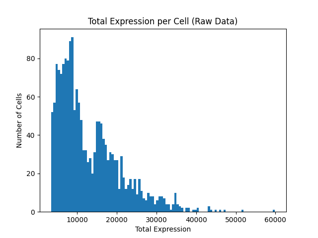
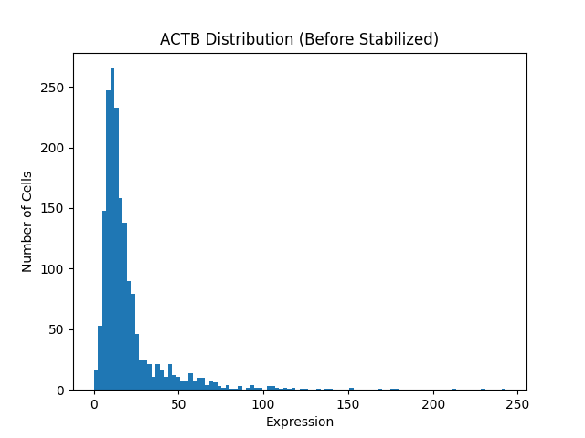

# Overview

본 프로젝트는 단일 세포에 대한 RNA 발현량 데이터를 분석하는 프로그램입니다.

[single-cell-pipeline](https://github.com/jyjunPepe012233/single-cell-pipeline) 레포지토리를 통해 학습한 내용을 활용하여 개발되었습니다.

### Raw Data vs After QC (Total Expression per Cell)

<p align='left'>
  
  
</p>

### Raw Data vs After Processing (Expression Distribution of Specific RNA)
<p align='left'>
  
  
</p>

# Project Structure

```
scRNA-expression-analysis-pipeline
├── data
│   ├── comparable
│   │   └── Bladder-10X_P4_4
│   │       └── comparable_Bladder-10X_P4_4.csv
│   ├── processed
│   │   └── Bladder-10X_P4_4
│   │       └── processed_Bladder-10X_P4_4.csv
│   └── raw
│       ├── Bladder-10X_P4_3
│       │   ├── barcodes.tsv
│       │   ├── genes.tsv
│       │   └── matrix.mtx
│       ├── Bladder-10X_P4_4
│       ├── Heart-10X_P7_4
│       └── ...
├── images
└── src
    ├── data_io.py
    ├── main.py
    ├── normalization.py
    ├── pipeline.py
    ├── quality_control.py
    └── visualization.py
```

# Key Features
- `/src/main.py`의 파라미터를 조작하여 28개의 데이터세트를 분석/시각화할 수 있습니다.
- .mtx 파일과 .tsv 파일 기반의 데이터세트를 활용합니다.
- 데이터 로드, QC, 정규화 및 안정화, 시각화 단계를 거칩니다.
- 세포별 유전자 발현량 히스토그램, 특정 유전자의 발현량 히스토그램을 제공합니다.

# Step 1. Data Loading & Validation

`/src/data_io.py` 패키지는 expression matrix 데이터 구조를 데이터프레임으로 파싱합니다.

해당 패키지는 아래와 같은 기능을 제공합니다.

- .mtx 파일과 .tsv 파일 기반의 데이터를 하나의 .csv로 변환
- .csv로 변환된 파일을 자동으로 재사용 (캐시)
- 처리가 끝난 파일을 .csv로 한번 더 저장 (기록)

실제 연구 환경을 상상하며 개발하였습니다.

# Step 2. Quality Control (QC)

모든 데이터가 분석에 적합하지 않았습니다.

RNA의 전체 발현량이 0인 세포가 있었는데, 해당 세포는 죽은 세포이거나 캡쳐 과정에 문제가 있었던 세포라고 생각했습니다.

프로그램의 엔트리 포인트(entry point)에서 설정한 기준(quality minimum threshold) 미달 세포를 저품질 세포로 간주하여 제외하였습니다.

데이터의 품질 기준 외의 조건 또한 엔트리 포인트에서 설정하여 데이터를 원하는 대로 분석할 수 있습니다.

`/src/schema.py`는 아래 기능을 제공합니다.

- Non-Numeric 데이터를 Nan으로 대체
- 저품질 세포 데이터 삭제 (세포별 전체 발현량 기준)
- 이상치 제거 (전체 발현량이 과하게 높은 데이터 제거)

# Step 3. Normalization

시퀀싱 깊이 차이 등으로 인해 총 발현량의 규모가 실제와 다르게 측정될 수 있다고 배웠습니다.

이를 보정하고 **유전자별 발현량 비율**을 제대로 파악하기 위해 특정 규모로 RNA 발현량을 정규화하였습니다.

`/src/normalization.py`는 아래 기능을 제공합니다.

- Library-size normalization: 각 세포의 총 발현량을 동일한 규모로 맞춤 (규모 설정 가능, 기본 10,000
- log1p 변환: log를 통해 분포를 안정화하여 극단값의 영향을 줄임

정규화 및 안정화(stabilization) 과정을 거친 데이터는
`/data/comparable/` 폴더에 .csv 형태로 저장됩니다.

# Step 4. Visualization & Validation

전처리 과정이 실제로 의미 있었는지 검증하기 위해 데이터를 시각화하였습니다.

`/src/visualization.py`에서 제공한 기능은 다음과 같으며,
`/images/` 폴더에서 예시 이미지를 확인할 수 있습니다.

- 세포별 전체 발현량 히스토그램 (QC 전, 후)
- 특정 유전자의 발현량 분포 비교 (전체 처리 과정 전, 후)

시각화를 통해 저품질 세포 및 이상치가 실제로 제거되었는지 확인하였으며,
정규화 및 안정화 과정을 거친 데이터의 분포가 어떻게 바뀌었는지 확인할 수 있었습니다.
